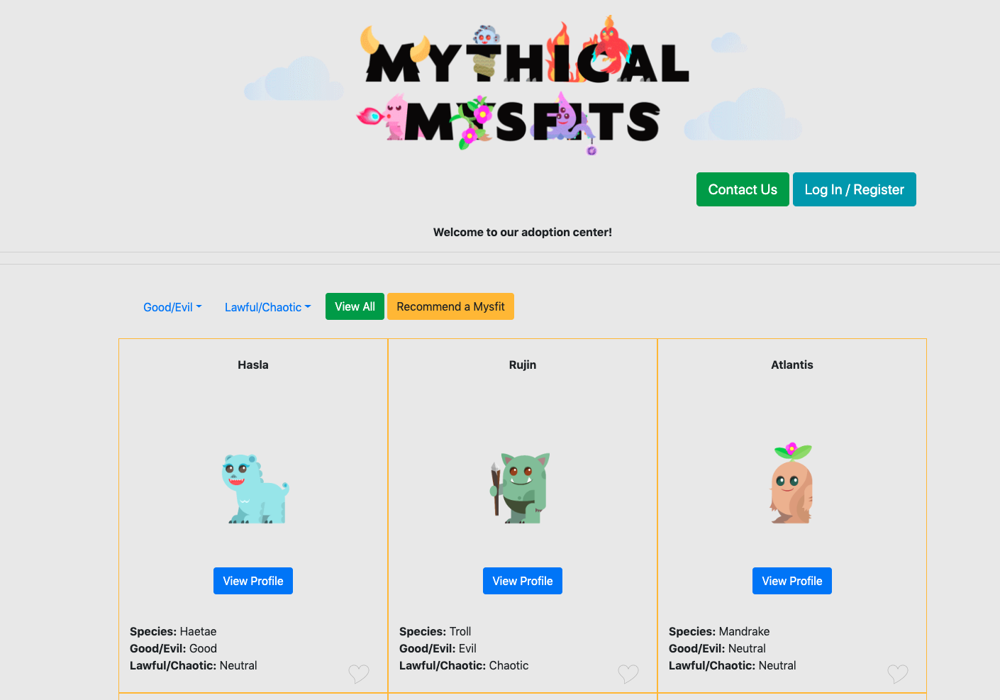
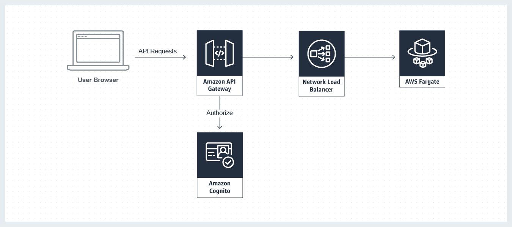

# Tiempo Development Practical Exercise

### Modern application infrastructure

The Mythical Mysfits website serves it's static content from Amazon S3 with Amazon CloudFront, provides a microservice API backend deployed as a container through AWS Fargate on Amazon ECS, stores data in a managed NoSQL database provided by Amazon DynamoDB, with authentication and authorization for the application enabled through AWS API Gateway/Network Load Balancer or Application Load balancer and it's integration with Amazon Cognito.  
You will be creating and deploying the required infrastructure to support this application on an Infrastructure as Code approach using Cloudformation.

### Application Architecture

### Expected Outputs

- Cloudformation templates inside the `infrastructure` directory
- Script to automatically create/update infrastructure and deploy the web application different layer:
- - Deploy Database structure and data
- - Deploy Backend Microservice infrastructure and service
- - Replace variables or placeholders in front end source
- - Deploy Front end static website
- Update this readme or present a PDF explaining the architectual decisions, how the layers communicate, etc. Explain your solution.

---

# The solution

### Requirements:

- AWS account - if you don't have one, it's easy and free to [create one](https://aws.amazon.com/)
- AWS IAM account with elevated privileges allowing you to interact with various AWS Services
- ###### A computer with the following OS
- Linux
- - MacOSX
- ###### The following commands MUST be isntalled in order to make it work

1. aws (AWS CLI).
2. docker (Docker CLI)
3. curl (commmand curl must be installed).
4. jq (JSON Query command for either Linux or MacOSX according to the OS you have installed) for linux it can be installed using `yum install jq` or `apt-get install jq` depending on the distro you are using, and for mac you can install it using the Homebrew channel with the command `brew install jq`.

### Helper scripts

A scripts folder was created, to set the bash scripts which wil help to install the stacks and do some work like docker compilation and file substitutions, the starter command was named "setup.sh" and you can call it by calling it from the project's root folder as:

> scripts/setup.sh

This command, will create all the stacks that will be described below, and also will compile the docker project, update the docker container, run a service using that compiled docker container, will alsomake a temporary folder named `website` in order to substitute the html files' place holders with the correct values, and will upload the files on the created `website` folder to a S3 bucket that was previously created within the other scripts, to make the static website be viewable from the outside world.

**Notes:**

- Whenever a stack is created, a JSON file will be created at the project's HOME folder using the following file format:
  > <STACK_NAME>.output.json

### Database deployment:

For the database deployment, the original stack file `data/MythicalMysfits-DynamoDB.template.yaml` was modified, to export some outputs, in order to be accesible from the rest of the stacks

1. Table
2. TableArn
3. Indexes

Then a script was created `scripts/data.sh` in order to create the stack using the `data/MythicalMysfits-DynamoDB.template.yaml` file, and also to populate the _DynamoDB_\* using the data on the file `data/populate-dynamodb.json`.

### VPC infrastructure

The designed VPC infrastructure for the project, is designed at the `infrastructure/cluster.yaml` file, and its creation bash script is the `scripts/cluster.sh`which is called under the `scritps/setup.sh` script, so there is no need to call it separately
