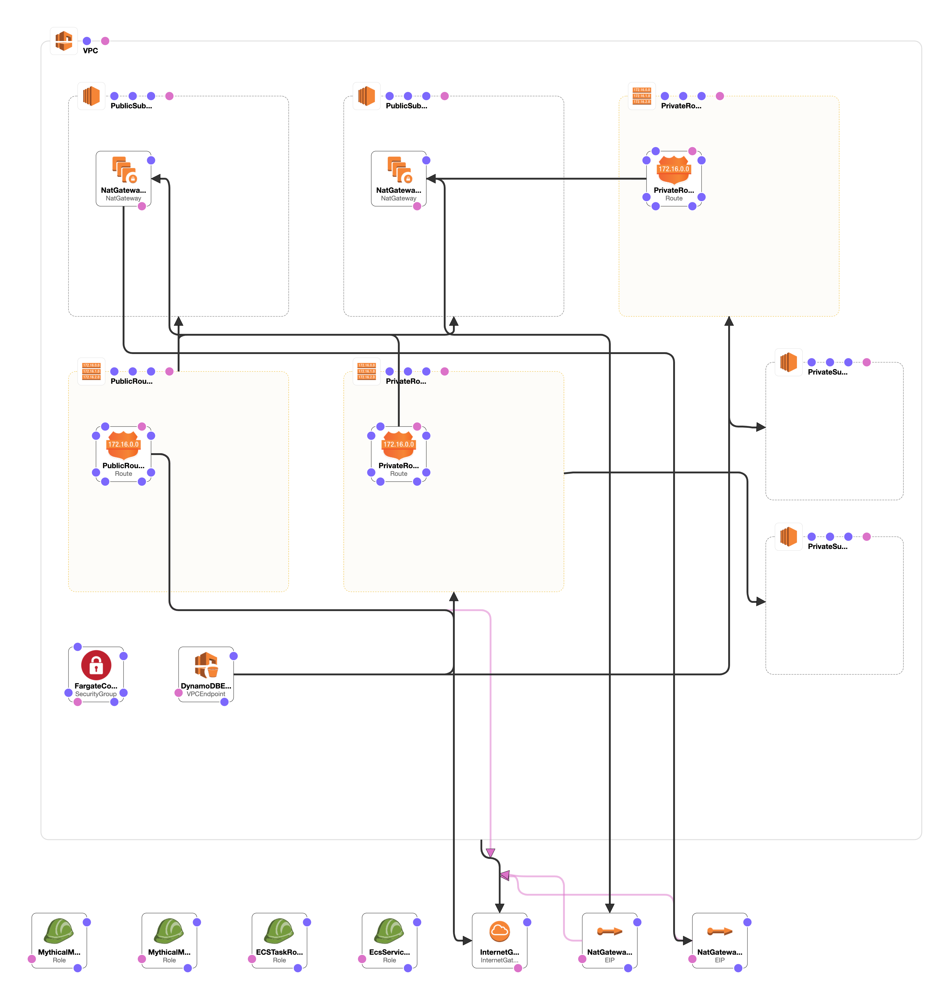
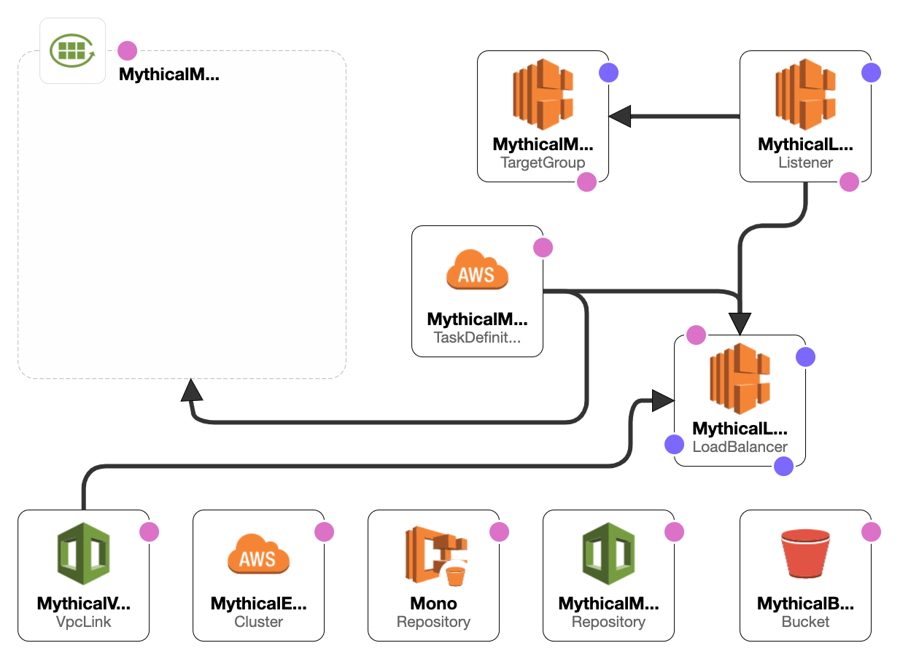
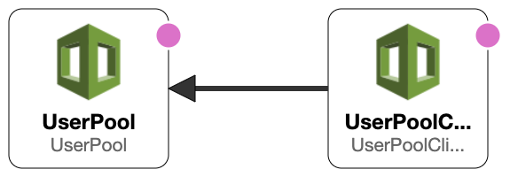

# Tiempo Development Practical Exercise

### Modern application infrastructure

The Mythical Mysfits website serves it's static content from Amazon S3 with Amazon CloudFront, provides a microservice API backend deployed as a container through AWS Fargate on Amazon ECS, stores data in a managed NoSQL database provided by Amazon DynamoDB, with authentication and authorization for the application enabled through AWS API Gateway/Network Load Balancer or Application Load balancer and it's integration with Amazon Cognito.  
You will be creating and deploying the required infrastructure to support this application on an Infrastructure as Code approach using Cloudformation.

### Application Architecture

### Expected Outputs

- Cloudformation templates inside the `infrastructure` directory
- Script to automatically create/update infrastructure and deploy the web application different layer:
- - Deploy Database structure and data
- - Deploy Backend Microservice infrastructure and service
- - Replace variables or placeholders in front end source
- - Deploy Front end static website
- Update this readme or present a PDF explaining the architectual decisions, how the layers communicate, etc. Explain your solution.

---

# The solution

### Requirements:

- AWS account - if you don't have one, it's easy and free to [create one](https://aws.amazon.com/)
- AWS IAM account with elevated privileges allowing you to interact with various AWS Services
- ###### A computer with the following OS
- Linux
- - MacOSX
- ###### The following commands MUST be isntalled in order to make it work

1. aws (AWS CLI).
2. docker (Docker CLI)
3. curl (commmand curl must be installed).
4. jq (JSON Query command for either Linux or MacOSX according to the OS you have installed) for linux it can be installed using `yum install jq` or `apt-get install jq` depending on the distro you are using, and for mac you can install it using the Homebrew channel with the command `brew install jq`.

### Helper scripts

A scripts folder was created, to set the bash scripts which wil help to install the stacks and do some work like docker compilation and file substitutions, the starter command was named "setup.sh" and you can call it by calling it from the project's root folder as:

> scripts/setup.sh

This command, will create all the stacks that will be described below, and also will compile the docker project, update the docker container, run a service using that compiled docker container, will alsomake a temporary folder named `website` in order to substitute the html files' place holders with the correct values, and will upload the files on the created `website` folder to a S3 bucket that was previously created within the other scripts, to make the static website be viewable from the outside world.

**Notes:**

- Whenever a stack is created, a JSON file will be created at the project's HOME folder using the following file format:
  > <STACK_NAME>.output.json

### Database deployment:

For the database deployment, the original stack file `data/MythicalMysfits-DynamoDB.template.yaml` was modified, to export some outputs, in order to be accesible from the rest of the stacks

1. Table
2. TableArn
3. Indexes

Then a script was created `scripts/data.sh` in order to create the stack using the `data/MythicalMysfits-DynamoDB.template.yaml` file, and also to populate the _DynamoDB_\* using the data on the file `data/populate-dynamodb.json`.

### VPC cluster definitions

The designed VPC infrastructure for the project, is designed at the `infrastructure/vpc-cluster.yaml` file, and its creation bash script is the `scripts/cluster.sh`which is called under the `scritps/setup.sh` script, so there is no need to call it separately

The VPC definitions will include:

- **An Amazon VPC** - a network environment that contains four subnets (two public and two private) in the 10.0.0.0/16 private IP space, as well as all the needed Route Table configurations. The subnets for this network are created in separate AWS Availability Zones (AZ) to enable high availability across multiple physical facilities in an AWS Region.
- **Two NAT Gateways** (one for each public subnet, also spanning multiple AZs) - allow the containers we will eventually deploy into our private subnets to communicate out to the Internet to download necessary packages, etc.
- **A DynamoDB VPC Endpoint** - our microservice backend will integrate with Amazon DynamoDB for persistence.
- **A Security Group** - Allows the docker containers to receive traffic on port 8080 from the Internet through the Network Load Balancer.
- **IAM Roles** - Identity and Access Management Roles are created. These will be used to give AWS services or resources you create access to other AWS services like DynamoDB, S3, and more.

### Microservice definitions

There is the need to create some definitions to deploy the docker project (microservice), these definitions are included at the `infrastructure/microservice.yaml` filem and its creation bash script is defined at the `scripts/microservice.sh` file, the definition includes

- **S3 Bucket** To contain and publish the static website.
- **ECS Repository** which will be the repository in which the docker containers will be pushed to.
- **ECS Cluser** This represents the cluster of “servers” that the service containers will be deployed to. Servers is in "quotations" because you will be using AWS Fargate. Fargate allows you to specify that your containers be deployed to a cluster without having to actually provision or manage any servers yourself.
- **AWS Cloudwatch log** For log collection and analysis. The logs that the container generates will automatically be pushed to AWS CloudWatch logs as part of this specific group. This is especially important when using AWS Fargate since we will not have access to the server infrastructure where your containers are running.
- **ECS Task Definition** To declare the set of containers and the resources and configuration those containers require.
- **Network Load Balancer (NLB)** To sit in front of our service tier. This would enable our frontend website code to communicate with a single DNS name while our backend service would be free to elastically scale in-and-out, in multiple Availability Zones, based on demand or if failures occur and new containers need to be provisioned.
- **Load Balancing Target Group** A target group to allow AWS resources to register themselves as targets for requests that the load balancer receives to forward. Our service containers will automatically register to this target so that they can receive traffic from the NLB when they are provisioned.
- **LoadBalancing Listener** To inform that load balancer that for requests received on a specific port, they should be forwarded to targets that have registered to the above target group.
- **VPC Link** Create a new RESTful API in front of our existing Flask service, so that we can perform request authorization before our NLB receives any requests. We will do this with Amazon API Gateway. In order for API Gateway to privately integrate with our NLB, we will configure an API Gateway VPC Link that enables API Gateway APIs to directly integrate with backend web services that are privately hosted inside a VPC.

### Cognito definitions

To integrate cognito into the mix, I have created a template which creates 2 basic Cognito definitions

- **Cognito User Pool** The Cognito User Pool where all of the Mythical Mysfits visitors will be stored, the stack definition will indicate that all users who are registered with this pool should automatically have their email address verified via confirmation email before they become confirmed users.
- **Cognito User Pool Client** In order to integrate our frontend website with Cognito, we must create a new User Pool Client for this user pool. This generates a unique client identifier that will allow our website to be authorized to call the unauthenticated APIs in cognito where website users can sign-in and register against the Mythical Mysfits user pool.

### Docker build and service creation

The steps to build the docker container and deploy the task using this docker definitions are called using the script `scripts/dockerOperations.sh` which is also called from the `scripts/setup.sh` script, this script needs the previous 4 tasks to be completed as it needs the DynamoDB, the VPC cluster, and the microservice definitions.

1. It extract some needed values from the `<STACKNAME>.output.json` files that were created in the previous steps.
2. It logins docker to the created **ECR Container** using the command
   > \$(aws ecr get-login --no-include-email --region < Region >)
3. Builds a **Docker Image**, and tags it `mythicalmysfits/service:latest`.
4. Creates a tag at the the **ECR Container** for the local `mythicalmysfits/service:latest`
5. Pushes the created **Docker Image** to **Amazon ECR Container**
6. Creates a FARGATE service using the **Task Definition**, **Load Balancer**, **Task Security Group**, and **Private Networks** Defined at the previuos stacks (**VPC Cluster**, **Microservice**).

This will make the servie available for the internal Load Balancer that was created.

### Cognito and static site definitions

In order to connect to cognito to the site via **Cognito Internet Gateway** the script `scripts/website.sh` was created, and its steps are as follows:

1. It extract some needed values from the `<STACKNAME>.output.json`
2. It makes a copy of the `backend/api/api-swagger.json` file.
3. If replaces the `REPLACE_ME_*` _place holders_ at the `api-swagger.json` copy file with the values it extracted on step 1.
4. It create the **REST API** using **Swagger** with the `api-swagger.json` file with the replaced values.
5. It deploys the **REST API** and it sets the stage name as prod.
6. It populates the variable API_ENDPOINT at the script using the **API_GATEWAY_ID** and the **REGION** to update the values at the static website
7. If copies the contents of the `frontend` folder to a temporary folder named `website`.
8. It replaces the _place holders_ at the HTML files with the proper values for:
   - Region.
   - API_ENDPOINT Obtained from the output files and from step 6.
   - COGNITO_USER_POOL_ID.
   - COGNITO_USER_POOL_CLIENT_ID.
9. It uploads the contents of the temporary folder to S3 bucket with public-read permissions, so they can be public to everyone.

In order to view the static website you can look at the `MysfitsMicroServiceStack.outputs.json` file for the `S3WebsiteEndpoint` value, copy and paste it to your web browser and you will be able to see it.

**Note**: You need to wait until the service task is up and responding, it will be something like 5 to 10 min after the script has finished. Meanwhile, you can go to the `Login/Register` button and click at the `Register` link, to register a new user, using a valid email address. After a little while, you will receive a confirmation email to that email address with a verification code, use it to verify at the website.

Do not forget to remove all stacks that where created, and also the `S3 bucket`, the `API gateway`, the `DynamoDB table` the `ECR Repository`, stop the `Service Task` at the `ECS Cluster` and after that remove the created `ECS Cluster` so you will not be overcharged for this operations.
